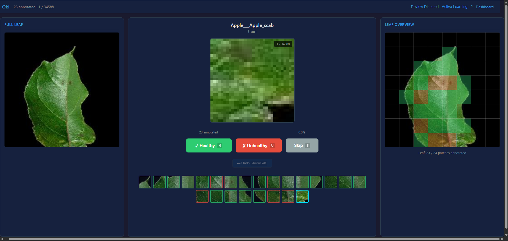
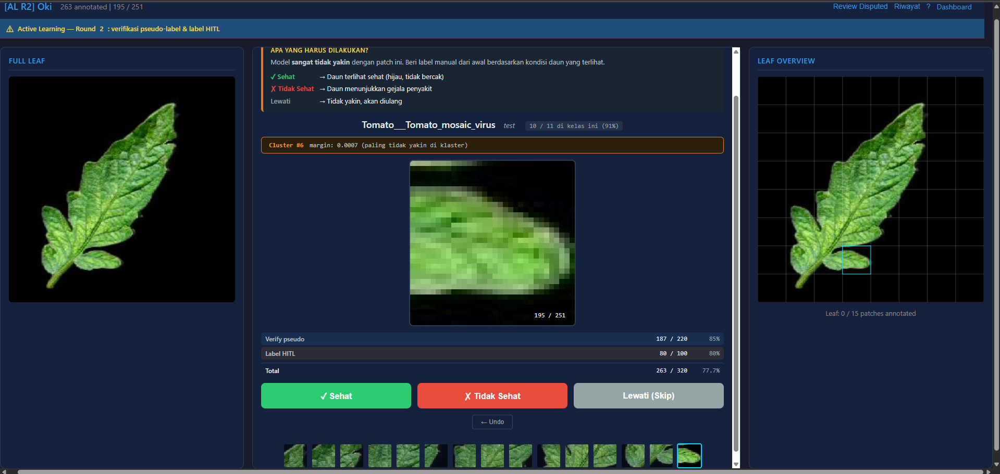
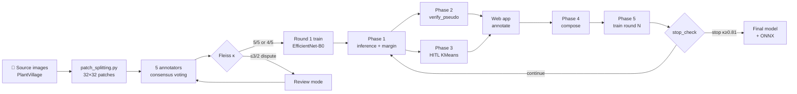

# 🌿 Annotation-ML-Leaf

> End-to-end pipeline for **plant disease detection** on PlantVillage: 5-annotator consensus labeling → Fleiss-κ review → active learning rounds → 5-architecture model training with ONNX export.



[](https://www.python.org)
[](https://fastapi.tiangolo.com)
[](https://pytorch.org)
[](https://developer.nvidia.com/cuda)
[](https://docs.astral.sh/uv)
[](LICENSE)

[](dataset_patches/)
[](dataset_patches/)
[](assignments_consensus.json)
[](predictions/)
[](https://github.com/Primarizki21/Annotation-ML-Leaf/commits/main)
[](https://github.com/Primarizki21/Annotation-ML-Leaf)

---

## What is this?

A solo-built research codebase that closes the loop on **plant leaf disease classification** end-to-end:

1. **Annotation** — A FastAPI web app where 5 human annotators label 32×32 patches as *healthy* or *unhealthy* across 22 PlantVillage classes. Consensus voting + Fleiss' κ flags disputed patches for review.
2. **Active learning** — A 5-phase loop (`inference → verify pseudo-label → HITL on uncertain clusters → compose → train`) that runs round after round, with an automatic `stop_check` based on agreement and accuracy plateaus.
3. **Training** — 5 mobile-friendly architectures (MobileNetV3-S, EfficientNet-B0, ShuffleNetV2, SqueezeNet, SmallInception) trained and exported to ONNX for inference.

It's the smallest full-stack ML pipeline I could ship that still does everything for real: human-in-the-loop labeling, multi-annotator agreement, multi-round active learning, and a model zoo. No external services, no managed databases — just a single Python process, a folder of patches, and a CSV.

---

## Screenshots

**Annotation mode** — single patch in focus, full-leaf context on the left, grid overview on the right. All three views stay in sync as you label.



**Active Learning — Round 2 (HITL)** — model predictions and uncertain-cluster patches, both annotatable. The blue banner is *verify pseudo-label*; the orange banner is *label manually* (model was unsure).

---

## Features

| | |
|---|---|
| 🎯 **Multi-annotator patch annotation** | 5 annotators, per-class assignment, autosave every annotation, CSV backup every 100. |
| 🔄 **Review mode for disputes** | Patches where 3+ annotators disagree are routed back for re-labeling. Fleiss' κ computed per class. |
| 🧠 **Active learning loop** | Verify pseudo-labels (high confidence) + label HITL (low margin, KMeans-clustered). 4 rounds completed. |
| 🏗️ **5-architecture training** | MobileNetV3-S, EfficientNet-B0, ShuffleNetV2, SqueezeNet, SmallInception. 2-phase (frozen backbone → fine-tune), early stop, resume-safe. |
| 📊 **Live dashboard** | Per-annotator, per-class, per-round progress at `/dashboard`, auto-refreshes every 30s. |
| 💾 **Resume-safe** | Local CSVs survive crashes. Web app state is gitignored; operator artifacts (`*.json`) are committed. |

---

## Pipeline



Detailed per-phase mermaid diagrams: see [`docs/active_learning_flow.md`](docs/active_learning_flow.md).

---

## Tech Stack

| Layer | Tools |
|---|---|
| **Backend** | [](https://fastapi.tiangolo.com) [](https://www.uvicorn.org) [](https://palletsprojects.com/p/jinja/) |
| **Frontend** | []() []() []() — no SPA framework, just templates + a small JS module layer |
| **Annotation** | [](https://pandas.pydata.org) [](https://python-pillow.org) |
| **ML** | [](https://pytorch.org) [](https://pytorch.org/vision) [](https://scikit-learn.org) [](https://onnx.ai) [](https://onnxruntime.ai) |
| **Viz** | [](https://matplotlib.org) |
| **Tooling** | [](https://docs.astral.sh/uv) — single lockfile, CUDA 13 PyTorch index |

---

## Project Structure

```
Annotation-ML-Leaf/
├── main.py                          # FastAPI backend server
├── pyproject.toml                   # Project config & dependencies (uv)
├── requirements.txt                 # Core dependencies for annotation
├── requirements-ml.txt              # ML dependencies (training/prediction)
│
├── extract_consensus.py             # Extract 5% consensus subset
├── assignments_generator.py         # Generate assignments_consensus.json
├── assignments_consensus.json       # Annotator-to-folder mapping
│
├── merge_annotations.py             # Merge per-annotator CSVs → master CSV
├── merge_annotation_consensus.py    # Vote tally, Fleiss Kappa, review CSV
│
├── train_consensus_model.py         # Train EfficientNet-B0 (active learning)
├── predict_unlabeled_patches.py     # Predict labels for remaining patches
├── active_learning_round.py         # AL pipeline (phases 1-5)
├── filtering_gambar.py              # Filter source images by selected crops
├── patch_splitting.py               # Split source images into 32×32 patches
├── eda.py                           # Exploratory data analysis on patches
│
├── stop_check.py                    # Convergence gate (κ, plateau, disabled classes)
│
├── templates/
│   ├── index.html                   # Annotation interface
│   └── dashboard.html               # Progress dashboard
├── static/                          # CSS + JS modules
├── screenshot/                      # README screenshots
├── docs/                            # active_learning_flow.md (mermaid)
│
├── predictions/                     # Active learning artifacts
│   ├── al_assignments_round{N}.json       # AL mode assignments (committed)
│   ├── cluster_representatives_round{N}.json  # Cluster metadata (committed)
│   ├── hitl_annotated_round{N}.csv        # HITL labels per round (committed)
│   ├── per_class_accuracy_round{N}.json   # Round accuracy report (committed)
│   ├── master_predictions_round{N}.csv    # Predictions (gitignored — too large)
│   └── embeddings_round{N}.npy            # Patch embeddings (gitignored)
│
├── dataset_patches/                 # Full patch dataset (gitignored)
├── dataset_consensus_only/          # 5% consensus subset (gitignored)
├── dataset_filtered/                # Filtered source images (gitignored)
├── annotations/                     # Per-annotator CSVs (gitignored)
├── models/                          # Trained checkpoints (gitignored)
└── outputs/                         # Training outputs (gitignored)
```

---

## Quick Start

### 🧑‍🏫 Annotator (friend)

You only need the web app to label. The operator handles the rest.

```bash
git clone https://github.com/Primarizki21/Annotation-ML-Leaf.git
cd Annotation-ML-Leaf

# install
uv sync                                    # or: pip install -r requirements.txt

# get the shared dataset
ln -s /path/to/shared-drive/dataset_patches dataset_patches

# run
uv run uvicorn main:app --reload --port 8000
# open http://localhost:8000
```

For AL rounds: `git pull` first to fetch the latest `predictions/al_assignments_round{N}.json`, then click **Active Learning** in the top bar.

### 🛠️ Operator (you)

Build the consensus dataset and kick off round 1:

```bash
uv sync --extra ml

# 1. Sample 5% consensus subset from full dataset
uv run python extract_consensus.py

# 2. Generate per-annotator assignments
uv run python assignments_generator.py

# 3. (annotators label via the web app)

# 4. Merge annotations + Fleiss κ
uv run python merge_annotations.py
uv run python merge_annotation_consensus.py

# 5. Train round 1 baseline
uv run python train_consensus_model.py
```

### 🤖 ML Engineer

Train any of the 5 architectures:

```bash
uv sync --extra ml
uv run python train_model_script/train_mobilenetv3_small.py
uv run python train_model_script/train_efficientnet_b0.py
uv run python train_model_script/train_shufflenetv2.py
uv run python train_model_script/train_squeezenet.py
uv run python train_model_script/train_small_inception.py
```

See [`train_model_script/INFERENCE.md`](train_model_script/INFERENCE.md) for ONNX export.

---

## Usage

### Annotation mode
1. On first launch, enter your name (must match `assignments_consensus.json`).
2. View the enlarged patch (32px upscaled with pixelated rendering).
3. Use keyboard shortcuts or buttons:
   - `H` / **Healthy** — label as healthy
   - `U` / **Unhealthy** — label as unhealthy
   - `S` / **Skip** — skip
   - `←` / **Undo** — undo last annotation
4. Progress autosaves after each annotation. CSV backup every 100.

### Leaf context view
Click **Show Leaf** to open a grid of all patches from the same source leaf. Annotated patches are color-coded (green = healthy, red = unhealthy). Click any tile to jump to it.

### Review mode
After consensus voting, split-decision patches are flagged `needs_discussion`. Re-annotate them in review mode → re-run the merge script to finalize.

### Progress dashboard
Visit [`/dashboard`](http://localhost:8000/dashboard) for per-annotator, per-class, and overall progress. Auto-refreshes every 30s.

---

## Active Learning

5 phases, run as separate commands. Output paths auto-update with `--round N`.

| Phase | Command | Output |
|---|---|---|
| 1. Inference | `uv run active_learning_round.py --phase 1 --round N` | `master_predictions_roundN.csv` |
| 2a. Generate | `uv run active_learning_round.py --phase 2 --subcommand generate --round N` | `al_assignments_roundN.json` |
| 2b. Verify | `uv run active_learning_round.py --phase 2 --subcommand verify --round N` | `pseudo_labeled_set_roundN.csv`, `hitl_annotated_roundN.csv` |
| 3. HITL select | `uv run active_learning_round.py --phase 3 --round N --budget 100 --margin-threshold 0.7` | adds `label_hitl` patches to `al_assignments_roundN.json` |
| 4. Compose | `uv run active_learning_round.py --phase 4 --subcommand compose --round N` | `roundN_dataset.csv` |
| 5. Train | `uv run active_learning_round.py --phase 5 --subcommand train --round N` | `models/roundN/model.pt` |

**Annotators** complete steps 2a → 3 via the web app (Active Learning mode).

**Stop gate** (`stop_check.py`): continues while Fleiss κ < 0.81, val accuracy still improving, uncertain pool ≥ 50, no disabled classes.

Full mermaid flow: [`docs/active_learning_flow.md`](docs/active_learning_flow.md).

---

## Training

5 architectures, all with the same 2-phase schedule (frozen backbone warmup → full fine-tune) and early stop.

| Architecture | File | Use case |
|---|---|---|
| MobileNetV3-Small | `train_mobilenetv3_small.py` | Mobile / edge deployment, smallest |
| EfficientNet-B0 | `train_efficientnet_b0.py` | Best accuracy/efficiency tradeoff |
| ShuffleNetV2 | `train_shufflenetv2.py` | Mobile, low FLOPs |
| SqueezeNet 1.1 | `train_squeezenet.py` | Tiny model, 0.5 MB |
| SmallInception | `train_small_inception.py` | Custom small inception block |

All scripts share common logic in [`_train_common.py`](train_model_script/_train_common.py). Default hyperparams tuned for 8-12 GB VRAM:

```bash
--batch_size 128 --save_every 1 --num_workers 8 --patience 5
```

ONNX export and inference recipe: [`train_model_script/INFERENCE.md`](train_model_script/INFERENCE.md).

---

## Dataset Statistics

| Dataset | Patches | Classes |
|---|---|---|
| Full (`dataset_patches/`, gitignored) | 234,729 | 22 |
| Consensus subset (`dataset_consensus_only/`, gitignored) | 34,611 | 22 |
| AL round 2 (verify_pseudo + label_hitl, 5 annotators) | 320 | 22 |
| AL round 3 | 320 | 22 |
| AL round 4 | 320 | 22 |

- **Consensus subset:** 5% random sample (per class) of diseased source leaves from the full dataset
- **Full dataset:** all patches before consensus voting — used for final model training and prediction
- **AL rounds:** 220 verify_pseudo + 100 label_hitl patches per round, distributed across 5 annotators. 87 are test split (used as gold-standard for evaluating future complex models)

---

## Documentation

- [`TROUBLESHOOTING.md`](TROUBLESHOOTING.md) — common issues by pipeline stage
- [`docs/active_learning_flow.md`](docs/active_learning_flow.md) — full mermaid diagrams of the AL pipeline
- [`train_model_script/INFERENCE.md`](train_model_script/INFERENCE.md) — ONNX export and inference
- [`active_learning_int.md`](active_learning_int.md) — AL internals deep-dive
- [`training_script.md`](training_script.md) — training pipeline notes
- [`fixing_loader.md`](fixing_loader.md) — dataloader fix history

---

## License

[MIT](LICENSE) © 2026 Primarizki Hariyono.

---

## Author

**Primarizki Hariyono** — [](https://www.linkedin.com/in/primarizkihariyono/) [](https://github.com/Primarizki21)

Built solo. Acknowledgments to the PlantVillage dataset and the 5 friends who did the annotation rounds.
